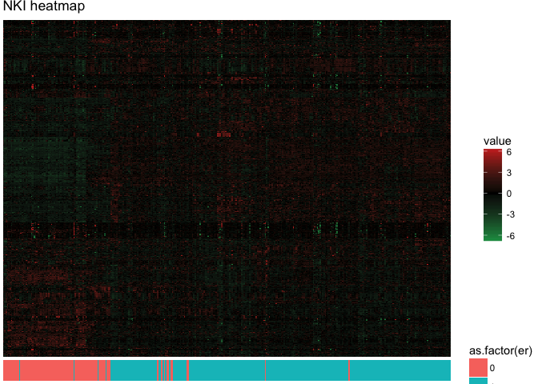

Basic transcripTools workflow
================
Dominic Pearce, The Institute of Genetics and Molecular Medicine, The University of Edinburgh
2018-05-28


#### Some quick examples using the NKI breast cancer data found in the `breastCancerNKI` package. We'll cover

1.  Simple feature selection by variance
2.  Structuring data for plotting by both MDS and as a heatmap
3.  Feature id conversion for further analysis

#### But first, what is the nki data? And what does it look like? Originally used as a [validation dataset for the 70-gene MammaPrint signature](https://www.ncbi.nlm.nih.gov/pubmed/12490681) this dataset has grown slightly in size but still is effectively the same collection of invasive breast cancer samples of no specific subtype. More information can be found in the [bioconductor package's web page](http://bioconductor.org/packages/release/data/experiment/html/breastCancerNKI.html) but, because there are issues with installing this on windows I've simply included the data here as part of `transcripTools`.

#### As a data object the nki data looks like this

``` r
library(transcripTools, quietly = TRUE)
library(Biobase, quietly = TRUE)
data(nki)
```

#### We have three slots of relevant information, the `assayData`, where the expression matrix is found, `phenoData` where the phenotypic data is found, and `featureData` where the feature data is found. We can see we have 337 samples and 24481 features to investigate. For the sake of this vignette we'll separate the nki expressionSet into individual pieces, though this is kind of against the fundamental prinicples of why an expressionSet is useful (which you can read up on [here](http://www.bioconductor.org/packages/3.7/bioc/vignettes/Biobase/inst/doc/ExpressionSetIntroduction.pdf)).

``` r
xpr <- exprs(nki) 
pheno <- pData(nki)
feats <- fData(nki)
```

1 Feature selection by variance
===============================

#### On the assumption that the genes that vary the most across our samples are the most biologically informative, we can choose the `n` most variable reduce the size/complexity of our subsequent investigation. To achieve this we use the `mostVar()` function, which will take our expression matrix (`xpr`) and the number of features we want to extract.

``` r
xpr_500 <- mostVar(xpr, 500)
dim(xpr_500)
```

\[1\] 500 337

 

2 Structuring data for plotting by both MDS and as a heatmap
============================================================

#### In both instances we will run the function of choice and then merge the results with our phenotypic data. This will arrange the data for very simple but power plotting using ggplot2.

### 2.1 MDS

#### For more information on multi-dimensional scaling see [here](https://statquest.org/2017/12/11/statquest-mds-and-pcoa-clearly-explained/)

``` r
mds_arg <- mdsArrange(xpr_500, isAlreadyScaled = TRUE) #the nki data is scaled 
                                        #around 0, not all data is like this
mds_mrg <- merge(mds_arg, pheno, by.x = "ids", by.y = "samplename")

head(mds_mrg)
```

| ids      |           x|          y| dataset | series |   id| filename |  size|  age|   er|  grade| pgr | her2 |  brca.mutation|  e.dmfs|  t.dmfs|  node|  t.rfs|  e.rfs|  treatment|  tissue|  t.os|  e.os|
|:---------|-----------:|----------:|:--------|:-------|----:|:---------|-----:|----:|----:|------:|:----|:-----|--------------:|-------:|-------:|-----:|------:|------:|----------:|-------:|-----:|-----:|
| NKI\_100 |  -8.6760908|  -1.251913| NKI     | NKI    |  100| NA       |   2.0|   48|    0|      3| NA  | NA   |              1|      NA|      NA|     0|     NA|     NA|          0|       1|    NA|    NA|
| NKI\_102 |   0.9149502|   2.205814| NKI     | NKI    |  102| NA       |   1.5|   50|    1|      3| NA  | NA   |              0|       1|    1201|     0|   1201|      1|          0|       1|    NA|    NA|
| NKI\_103 |  -8.3723925|  -1.263706| NKI     | NKI    |  103| NA       |   3.0|   42|    0|      3| NA  | NA   |              0|       1|    1809|     0|   1809|      1|          0|       1|  2110|     1|
| NKI\_104 |  -6.4673398|  -2.363459| NKI     | NKI    |  104| NA       |   0.5|   34|    0|      2| NA  | NA   |              0|       1|     672|     0|    672|      1|          0|       1|    NA|    NA|
| NKI\_106 |  -6.8465643|  -1.802001| NKI     | NKI    |  106| NA       |   1.5|   35|    0|      3| NA  | NA   |              0|       1|     701|     0|    701|      1|          0|       1|    NA|    NA|
| NKI\_107 |   1.9765115|   2.095211| NKI     | NKI    |  107| NA       |   0.2|   38|    1|      3| NA  | NA   |              0|       1|     929|     0|    929|      1|          0|       1|  1261|     1|

#### With our data ready to plot we simply call `ggplot` and specify our colours etc. using `mds_mrg`'s column headings. Unsurprisingly, when we colour by `er` (estrogen receptor status) we see that the 500 most variable genes capture and separate our samples by this factor.

``` r
library(ggplot2, quietly = TRUE)

ggplot(mds_mrg, aes(x = x, y = y, colour = as.factor(er))) + 
    geom_point() +
    labs(x = "PC1", y = "PC2", colour = "ER-status",
        title = "NKI MDS")
```


### 2.2 Heatmaps

#### The process is pretty much the same as for `mdsArrange`, though `heatmapArrange` has a couple of extra arguments that allow for hierarchical clusterting and scaling. Again, here's a little info on [heatmaps](https://www.youtube.com/watch?v=oMtDyOn2TCc) and [hierarchical clustering](https://www.youtube.com/watch?v=7xHsRkOdVwo)

``` r
hm_arg <- heatmapArrange(xpr_500, 
                        cluster_row = TRUE,
                        cluster_col = TRUE,
                        scale = TRUE,
                        by_row = TRUE) 
```

\[1\] "scale\_fill\_gradient2 green-red colour reminder: scale\_fill\_gradient2(high = '\#d73027', mid = 'black', low = '\#1a9850') "

### `heatmapArrange` handily reminds us of the colour function to hand to ggplot to get a green-red (*bad!* not good for colour blindness!) heatmap.

``` r
hm_mrg <- merge(hm_arg, pheno, by.x = "col_var", by.y = "samplename")

head(hm_mrg)
```

| col\_var | row\_var        |       value| dataset | series |   id| filename |  size|  age|   er|  grade| pgr | her2 |  brca.mutation|  e.dmfs|  t.dmfs|  node|  t.rfs|  e.rfs|  treatment|  tissue|  t.os|  e.os|
|:---------|:----------------|-----------:|:--------|:-------|----:|:---------|-----:|----:|----:|------:|:----|:-----|--------------:|-------:|-------:|-----:|------:|------:|----------:|-------:|-----:|-----:|
| NKI\_100 | NM\_006551      |  -1.1178172| NKI     | NKI    |  100| NA       |     2|   48|    0|      3| NA  | NA   |              1|      NA|      NA|     0|     NA|     NA|          0|       1|    NA|    NA|
| NKI\_100 | NM\_002411      |  -1.1285167| NKI     | NKI    |  100| NA       |     2|   48|    0|      3| NA  | NA   |              1|      NA|      NA|     0|     NA|     NA|          0|       1|    NA|    NA|
| NKI\_100 | NM\_000909      |  -1.1309867| NKI     | NKI    |  100| NA       |     2|   48|    0|      3| NA  | NA   |              1|      NA|      NA|     0|     NA|     NA|          0|       1|    NA|    NA|
| NKI\_100 | Contig46937\_RC |  -1.2955050| NKI     | NKI    |  100| NA       |     2|   48|    0|      3| NA  | NA   |              1|      NA|      NA|     0|     NA|     NA|          0|       1|    NA|    NA|
| NKI\_100 | Contig14284\_RC |  -1.5578914| NKI     | NKI    |  100| NA       |     2|   48|    0|      3| NA  | NA   |              1|      NA|      NA|     0|     NA|     NA|          0|       1|    NA|    NA|
| NKI\_100 | NM\_001871      |  -0.7384182| NKI     | NKI    |  100| NA       |     2|   48|    0|      3| NA  | NA   |              1|      NA|      NA|     0|     NA|     NA|          0|       1|    NA|    NA|

``` r
p_hmap <- ggplot(hm_mrg, aes(x = col_var, y = row_var, fill = value)) + 
    geom_tile() +
    scale_fill_gradient2(high = "#d73027", mid = "black", low = "#1a9850") + 
    labs(title = "NKI heatmap") +
    theme_void()
```

#### Heatmaps produced this can be combined with a colour bar using the [cowplot packages's](https://cran.r-project.org/web/packages/cowplot/vignettes/introduction.html) `plot_grid()`.

``` r
p_bar <- ggplot(hm_mrg, aes(x = col_var, y = "ER", fill = as.factor(er))) +
    geom_tile() + 
    theme_void()

# cowplot annoying overrides the default theme so we combine
# calling it with resetting the default theme
library(cowplot); theme_set(theme_grey()) 

plot_grid(p_hmap, p_bar, ncol = 1, rel_heights = c(15, 1), align = 'v')
```



 

3 Feature id conversion for further analysis
============================================

#### Finally, our features are currently in the refseq id format and perhaps we want HGNC official gene symbols instead. We can use two functions to achieve this, `idReplace()` that will convert and replace the ids in the expression matrix, or `idConvert()` that will simply convert a vector of ids. Here we'll use `idConvert()`.

``` r
mv_10 <- row.names(xpr_500)[1:10]

idConvert(mv_10, format_in = "refseq_mrna", format_out = "hgnc_symbol")
```

| refseq\_mrna | hgnc\_symbol |
|:-------------|:-------------|
| NM\_000909   | NPY1R        |
| NM\_001871   | CPB1         |
| NM\_002411   | SCGB2A2      |
| NM\_003226   | TFF3         |
| NM\_004496   | FOXA1        |
| NM\_006551   | SCGB1D2      |
| NM\_018476   | BEX1         |
